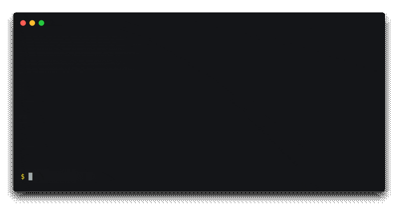

<div align="center" markdown=1>
	<p align="center"></p>
	<strong>Comment with a few clicks under a ton of steam profiles, groups, sharedfiles & discussions!</strong>
	<br>See how to set up the bot and customize it below.<br>
	<p></p>
</div>

<div align="center">

[](https://nodejs.org/)
[](https://github.com/3urobeat/steam-mass-comment-bot)
[](https://steamcommunity.com/groups/3urobeatGroup)
[](https://github.com/sponsors/3urobeat)
<p align="center">Click on a badge to learn more.</p>



</div>

&nbsp;

## ✨ Introduction:
This is a simple Steam Comment Bot to send comments with \*one\* account to \*many\* profiles, groups, sharedfiles or discussions.  

This project is a slimmed down version of my [steam-comment-service-bot](https://github.com/3urobeat/steam-comment-service-bot), for users only interested in regularly sending comments with one account to profiles of their friends.  
If you need more features, please check it out instead.  
It does way more besides acting as a comment service - it supports hundreds of accounts simultaneously, has advanced connection management features and is updated more regularly.

&nbsp;

> [!WARNING]
> I, 3urobeat (the developer), am not responsible and cannot be held liable for any action the operator/user of this bot uses it for.  
> By using this application, you agree to using it responsibly!  
  
&nbsp;

## 📝 Download & Setup:
Click here: [Download](https://github.com/3urobeat/steam-mass-comment-bot/archive/master.zip)  
Extract the zip and open the `steam-mass-comment-bot` folder.  
  
You need to have at least node.js version 16.0.0 installed: [Download](https://nodejs.org)  
To check your version number if you already have node installed, type `node --version` in your console or terminal.  

&nbsp;

**Login information:**  

Open `logininfo.json` with a text editor and fill in the username and password of your account into the provided brackets.  

If you want to login with a QR Code instead, then set the password to "qrcode".  
Upon starting the bot a QR Code will be presented, which you can scan using your Steam Mobile App to login.

If you have a shared secret (used to "bypass" Steam Guard Code), you may provide it at `sharedSecret`.  
If not, leave the brackets empty like default. This feature is entirely optional.

Save and exit.

&nbsp;

**Destinations:**  
Open the text file `destinations.txt` with a text editor.  
Put in the URLs, vanities or steamID64s of every profile/group/sharedfile/discussion you want to comment on, one destination per line.

Example:
```
"ID1",
"steamcommunity.com/id/name2",
"https://steamcommunity.com/profiles/ID3",
"3urobeatGroup",
"https://steamcommunity.com/app/739630/discussions/0/1750150652078713439",
"https://steamcommunity.com/sharedfiles/filedetails/?id=2496710411"
```


&nbsp;

**Configuration:**  
Open `config.json` with a text editor.  

If you want to set a custom status and play games when running the bot, fill in the `playingGames` array in the config.  
The array works like this: `["custom game text", game id, game id]`  
Empty the array (like this `"playingGames": []`) if the bot should not play anything.  
Remove the first argument and only provide game ids if you don't want to display a "Non-Steam game" text on your profile.
  
If the bot should respond with a message if someone messages you while the bot is running, set a message as `afkMessage`.  
Empty the brackets (like this `"afkMessage": ""`) to disable the feature.  

Take a look below at *Troubleshooting* if you experience issues.  

&nbsp;

**Advanced-ish settings:**  
The `commentdelay` value sets the time in ms the bot should wait between comments. I suggest leaving it at the default value.  
Setting it too low will result in cooldown errors because Steam considers your account as spamming.  
Should you receive cooldown errors with the default values, increase the value and try again.  

The `destinationResolveDelay` value determines how long the bot will wait between resolving the ID behind every destination you have set.  
The default value of 1000ms should be pretty lenient, if you configure A LOT of destinations you might need to increase this though.  
Just keep the default setting and only change it if you are getting errors on start.

&nbsp;  

## 🚀 Starting the bot:
Please open a console window or terminal in the current folder.  
Run the command `npm install --omit=dev` and wait for it to complete. This will install all necessary packages for the bot.  
Ignore any "x vulnerabilities" messages, these are unavoidable and have no relevance for you.

When done, type `node index.js` to start the bot.  
It should log into your account, ask for a Steam Guard code if necessary, and start commenting on each destination you have set, one after another.  

&nbsp;

If you are on Windows and don't know how to open a console window in the current folder:  
- Open the folder of the bot with your Explorer  
- Click on the blue `File` button in in the top left  
- Click on the `Open PowerShell` or `Open CMD` entry and a console window should appear

&nbsp;

## 💡 Troubleshooting:
If you don't follow the syntax from the config setup guide above, you will get an error because the bot is unable to read the file.  
If you are getting a syntax mistake error then check for these common mistakes:  
- forgot to add a comma to the end of the line?
- the very last line must not have a comma (look at the example above)
- forgot brackets `"` when writing something?  

&nbsp;  

If you get another error or have questions, please [open an issue here](https://github.com/3urobeat/steam-mass-comment-bot/issues/new).  
Everything that appears in your console/terminal window will also be saved to the `output.txt` file. Please attach the content of your last run to your issue to make it easier for me to troubleshoot.  
